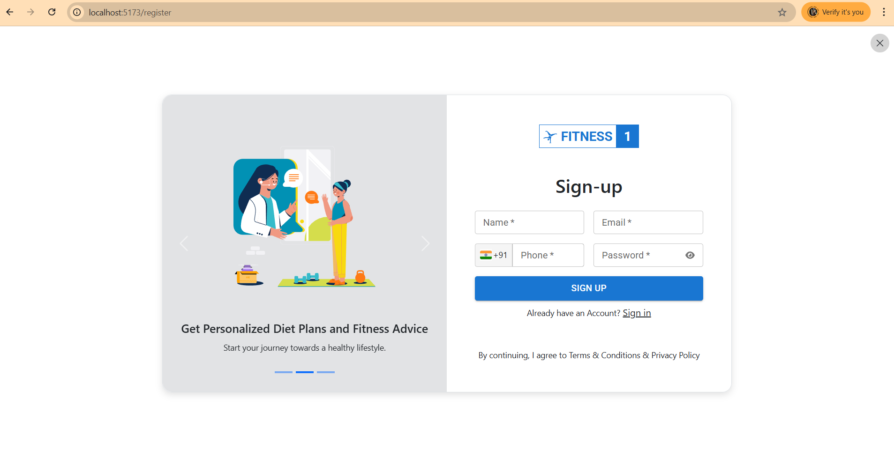
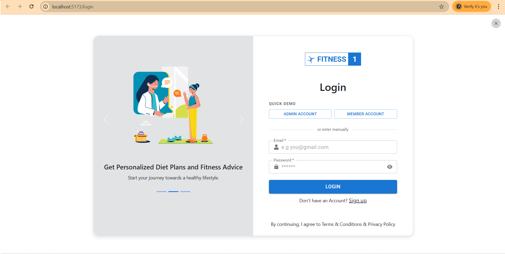
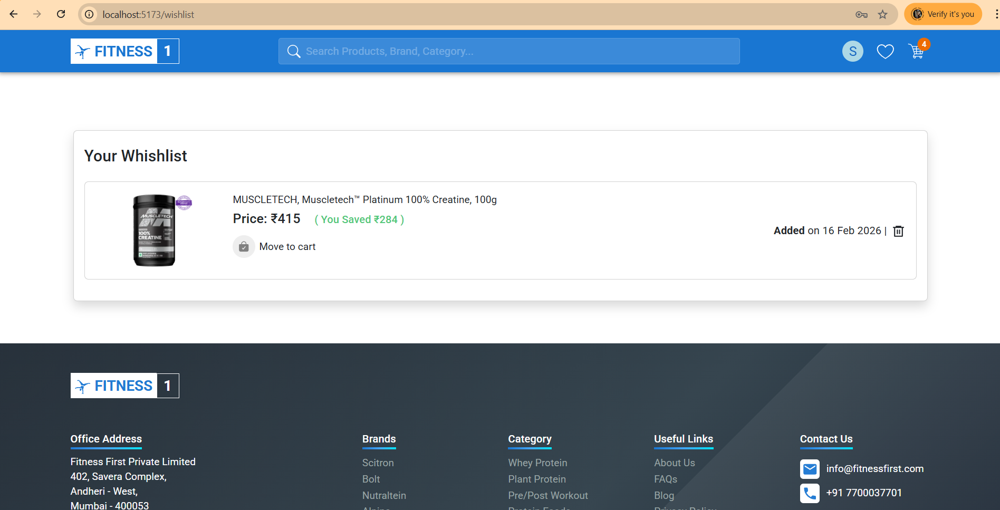
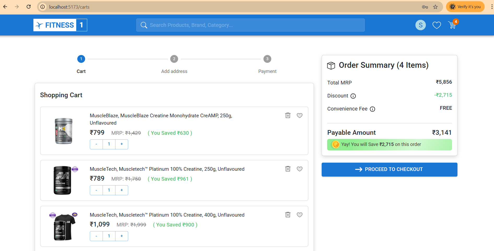
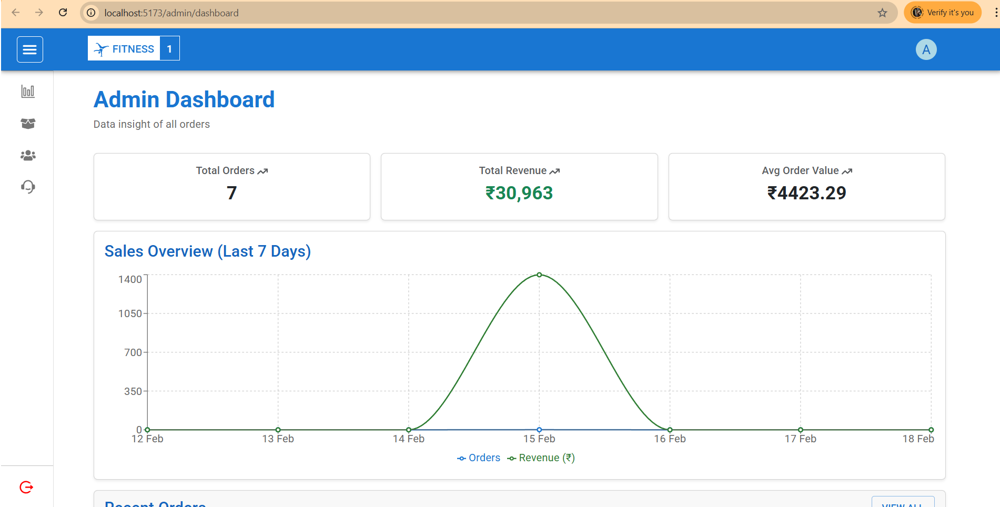

🛒 E-Commerce Web Application (MERN Stack)

A full-featured MERN Stack E-Commerce Application built with modern web technologies.
Users can browse products, manage cart, place orders, check order history, manage wishlists, add reviews & rating and admins can manage products & users.
________________________________________
🔗 Live Demo
•	🌐 Frontend (Vercel): https://firstfitness.vercel.app
•	🚀 Backend API (Render): https://mern-backend-x5mq.onrender.com
________________________________________
✨ Features
👤 User Features
•	User Registration & Login
•	JWT Authentication & Authorization
•	Browse Products
•	Product Details Page
•	Add to Cart
•	Update / Remove Cart Items
•	Place Orders (Cash on Delivery)
•	View Order History
•	Responsive UI (Mobile Friendly)

🛠 Admin Features
•	Admin Dashboard
•	Add / Edit / Delete Products
•	Manage Users
•	View All Orders
•	Protected Admin Routes
________________________________________
🛠 Tech Stack
Frontend
•	React.js
•	React Router
•	Context API and Redux 
•	MUI 

Backend
•	Node.js
•	Express.js
•	MongoDB
•	JWT Authentication
•	bcrypt for password hashing
________________________________________
📂 Project Structure
ecommerce-app/
│
├── Frontend/        # React Frontend
│   ├── src/
│   └── public/
│
├── Backend/        # Node + Express Backend
│   ├── controllers/
│   ├── models/
│   ├── routes/
│   └── middleware/
________________________________________
⚙️ Installation & Setup (Local Development)
1️⃣ Clone Repository
Frontend: https://github.com/Anii1445/mern-frontend.git
Backend: https://github.com/Anii1445/mern-backend.git

2️⃣ Install Dependencies
Frontend: cd Frontend & npm install
Backend: cd Backend & npm install

3️⃣ Environment Variables
Create a .env file inside server/:
PORT=5000
MONGO_URI=your_mongodb_connection_string
JWT_SECRET=your_secret_key

4️⃣ Run Application
Backend: npm run dev
Frontend: npm start
________________________________________
📸 Screenshots: 
 
### Sign-Up Page

 
### Login Page

 
### Wishlist Page

### Cart Page

 
### Admin Dashboard Page

 ________________________________________
🔐 Authentication Flow
•	Passwords are hashed using bcrypt
•	JWT tokens stored securely
•	Protected routes using middleware
•	Role-based authorization (Admin / User)
________________________________________
🚀 Deployment
•	Frontend deployed on Vercel
•	Backend deployed on Render
•	MongoDB Atlas used for cloud database
________________________________________
🎯 What I Learned
•	Building scalable REST APIs
•	Implementing JWT-based authentication
•	Role-based access control
•	Managing global state in React
•	Production deployment & environment configuration
•	Structuring large MERN applications
________________________________________
🔮 Future Improvements
•	Payment Gateway Integration (Stripe / Razorpay)
•	Order Status Tracking
•	Email Notifications
•	Performance Optimization
________________________________________
👨‍💻 Author
Ankit Gupta
GitHub: https://github.com/Anii1445
LinkedIn: https://linkedin.com/in/yourprofile

