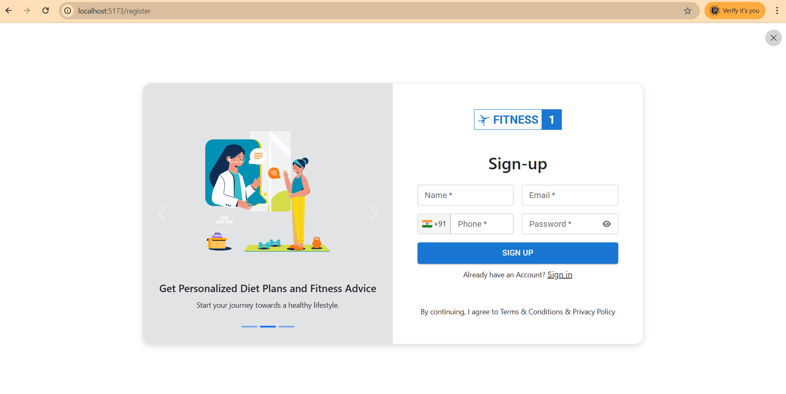
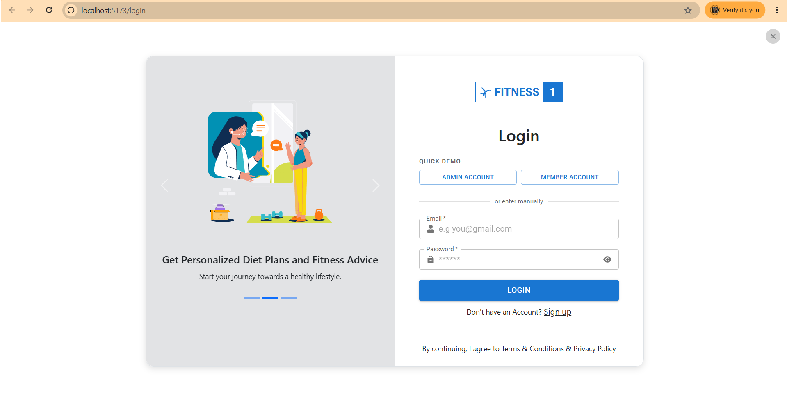
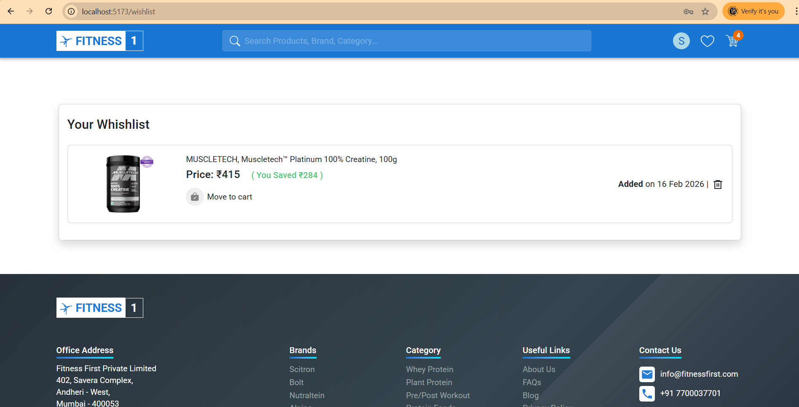
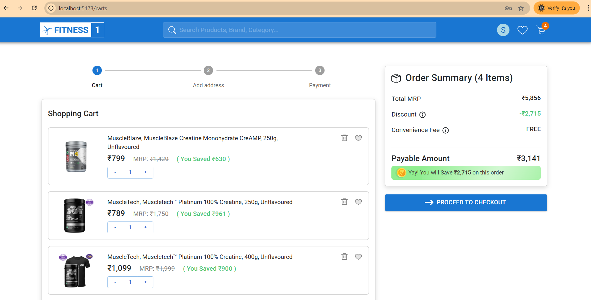
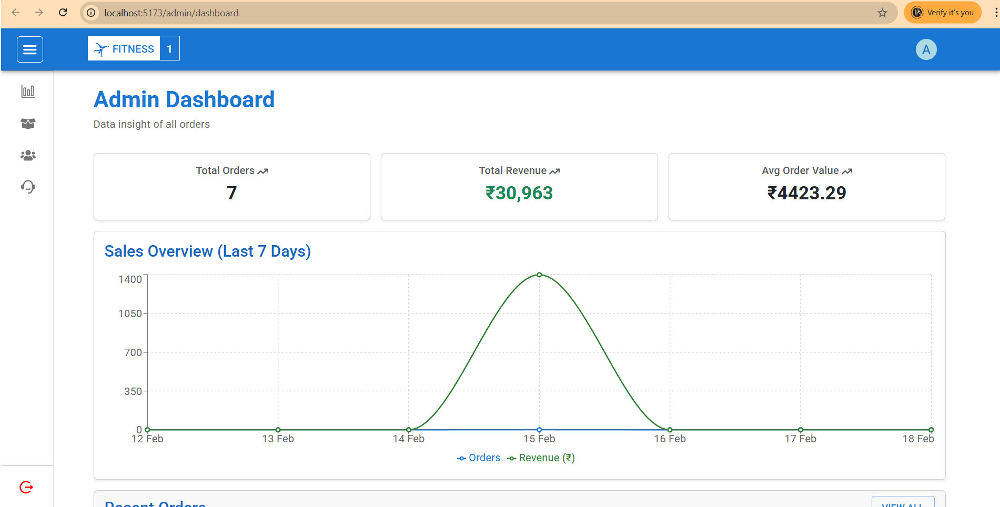

# 🛒 E-Commerce Web Application (MERN Stack)

A full-featured **MERN Stack E-Commerce Application** built with modern web technologies, designed specifically for fitness enthusiasts. Users can browse products, manage cart, place orders, check order history, manage wishlists, add reviews & ratings — and admins can manage products & users.

---

## 🔗 Live Demo

| Service | Link |
|--------|------|
| 🌐 Frontend (Vercel) | [firstfitness.vercel.app](https://firstfitness.vercel.app) |
| 🚀 Backend API (Render) | [mern-backend-x5mq.onrender.com](https://mern-backend-x5mq.onrender.com) |

---

## 📸 Screenshots

| Page | Preview |
|------|---------|
| 📝 Sign-Up |  |
| 🔑 Login |  |
| ❤️ Wishlist |  |
| 🛒 Cart |  |
| 📊 Admin Dashboard |  |

---

## ✨ Features

### 👤 User Features

| Feature | Description |
|--------|-------------|
| 🔐 Auth | User Registration & Login with JWT |
| 🛍️ Browse | Explore product listings & detail pages |
| 🛒 Cart | Add, update, or remove cart items |
| 📦 Orders | Place orders (Cash on Delivery) |
| 📋 History | View past order history |
| ❤️ Wishlist | Manage personal wishlist |
| ⭐ Reviews | Add reviews & ratings |
| 📱 Responsive | Mobile-friendly UI |

### 🛠️ Admin Features

| Feature | Description |
|--------|-------------|
| 📊 Dashboard | Overview of store activity |
| 🏷️ Products | Add, edit, and delete products |
| 👥 Users | Manage registered users |
| 📦 Orders | View and track all orders |
| 🔒 Access | Protected admin-only routes |

---

## 🛠️ Tech Stack

### Frontend

| Technology | Purpose |
|-----------|---------|
| React.js | UI Framework |
| React Router | Client-side routing |
| Context API & Redux | State management |
| Axios | HTTP requests |
| MUI & Bootstrap | UI components & styling |

### Backend

| Technology | Purpose |
|-----------|---------|
| Node.js | Runtime environment |
| Express.js | Web framework |
| MongoDB | NoSQL database |
| JWT | Authentication |
| bcrypt | Password hashing |

---

## 📂 Project Structure

```
ecommerce-app/
│
├── Frontend/           # React Frontend
│   ├── src/
│   └── public/
│
└── Backend/            # Node + Express Backend
    ├── controllers/
    ├── models/
    ├── routes/
    └── middleware/
```

---

## ⚙️ Installation & Setup (Local Development)

### 1️⃣ Clone Repository

| Part | Repository |
|------|-----------|
| Frontend | `git clone https://github.com/Anii1445/mern-frontend.git` |
| Backend | `git clone https://github.com/Anii1445/mern-backend.git` |

### 2️⃣ Install Dependencies

```bash
# Frontend
cd Frontend && npm install

# Backend
cd Backend && npm install
```

### 3️⃣ Environment Variables

Create a `.env` file inside `Backend/`:

```env
PORT=5000
MONGO_URI=your_mongodb_connection_string
JWT_SECRET=your_secret_key
```

### 4️⃣ Run Application

```bash
# Backend
npm run dev

# Frontend
npm start
```

---

## 🔐 Authentication Flow

| Step | Detail |
|------|--------|
| 🔑 Passwords | Hashed using `bcrypt` |
| 🪙 Tokens | JWT stored securely |
| 🛡️ Routes | Protected via middleware |
| 👮 Roles | Role-based authorization (Admin / User) |

---

## 🚀 Deployment

| Service | Platform |
|--------|---------|
| 🌐 Frontend | Vercel |
| 🚀 Backend | Render |
| 🗄️ Database | MongoDB Atlas |

---

## 🎯 What I Learned

- Building scalable REST APIs
- Implementing JWT-based authentication
- Role-based access control
- Managing global state in React
- Production deployment & environment configuration
- Structuring large MERN applications

---

## 🔮 Future Improvements

| Feature | Status |
|--------|--------|
| 💳 Payment Gateway (Stripe / Razorpay) | 🔄 Planned |
| 📦 Order Status Tracking | 🔄 Planned |
| 📧 Email Notifications | 🔄 Planned |
| ⚡ Performance Optimization | 🔄 Planned |
